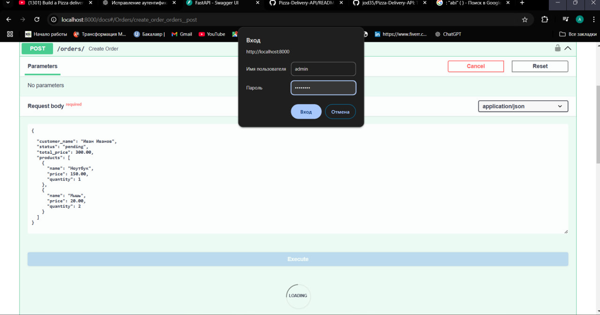

# fastapiprojects

## This is test task project using framework FastAPI. In project main idea recruties orders

1.**Installation**
Clone the repository.
`git clone https://github.com/nadoebashit/fastapiprojects.git`
2.Navigate into the project directory and make a copy of the example environment variables file.
`cd testatsk_dg`

**Quickstart**
These steps show how to set up the database and the application using Docker.

1. In the project root directory, build the Docker images.
   `docker-compose build`
2. Run the Docker containers.
   `docker-compose up`

At this point, the application should be running at http://localhost:8000/. To stop the application, you can run:
`docker-compose down`

3. To restart or rebuild the application, you can run:
   `docker-compose up --build`

**Documentation**
FastAPI autogenerates an OpenAPI specification, which allows you to test this application directly from an interactive console in your browser. It uses the Pydantic model to validate user input (as shown in the models section of the specification, below). Go to http://0.0.0.0:8000/docs to use the automatic interactive API documentation for this application (provided by Swagger UI) to send requests.

**POST**/orders/
this is enpoint create orders
request body
example json file

```{
  "id": 2,
  "customer_name": "Orazbek",
  "status": "pending",
  "total_price": 300.00,
  "products": [
    {
      "name": "Ноутбук",
      "price": 150.00,
      "quantity": 1
    },
    {
      "name": "Мышь",
      "price": 20.00,
      "quantity": 2
    }
  ]
}
```

After the file has been set, the authorization form will open. login: "admin"
password: "admin123"

**After that, the creation request was successfully sent.**

**GET**/orders/

This endpoint lists all the orders using filtr

**PUT**/orders/{order_id}

Updates the details of an existing order
order_id (int): The unique identifier of the order to be updated.
**Request Body**:
A JSON object containing the fields to update (e.g., status, products).
Response:
Success: Returns the updated order and a success message.
Failure: Returns an error message if the order is not found.

**DELETE**/orders/{order_id}

Soft Delete Order

Description: Softly deletes an existing order by marking it as deleted.
**Path Parameter**:
order_id (int): The unique identifier of the order to be deleted.
**GET**/metrics -GET Metrics
Description: Retrieves performance metrics for the API endpoints.
Response:
Returns metrics such as request counts, response times, and status codes for all API endpoints.
